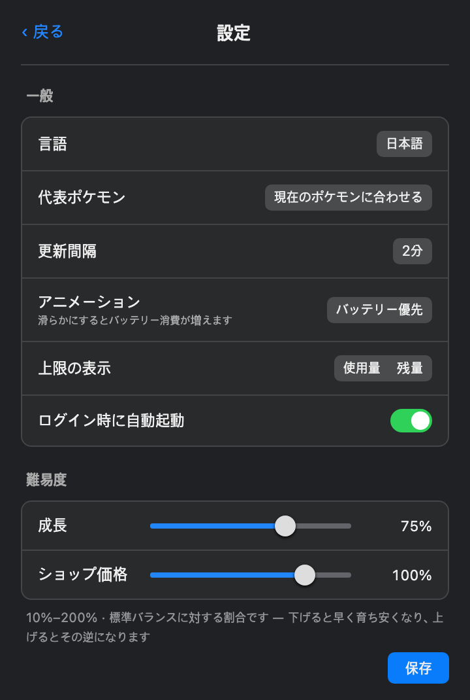

<div align="center">


# PokeTokenBar

**あなたのAIコーディングトークンを、ポケモンに — メニューバーで。**

[](https://github.com/chattymin/PokeTokenBar/releases)
[](https://www.apple.com/macos/)
[](https://swift.org)
[](#homebrew)
[](LICENSE)
[](https://github.com/sponsors/chattymin)

<a href="https://trendshift.io/repositories/84522?utm_source=repository-badge&amp;utm_medium=badge&amp;utm_campaign=badge-repository-84522" target="_blank" rel="noopener noreferrer"></a>
<a href="https://trendshift.io/repositories/84522?utm_source=trendshift-badge&amp;utm_medium=badge&amp;utm_campaign=badge-trendshift-84522" target="_blank" rel="noopener noreferrer"></a>


[English](README.md) · [한국어](README.ko.md) · **日本語**

</div>

PokeTokenBar は、あなたがすでに使っている AI コーディングトークン（Claude Code・Codex・Gemini CLI・Antigravity・OpenCode・Hermes Agent・Cursor・Grok CLI・Copilot CLI・Kiro CLI・Pi Agent・omp）を、macOS メニューバーの中で育っていく **ポケモンのパートナー** に変えます。トークンを使うとタマゴが孵化し、実際の進化ラインに沿って進化し、最終進化後に図鑑へ卒業して、また新しいタマゴが始まります。パートナーの下には正確な使用量トラッカーがあります — 今日の使用量・コスト、公式の5時間／週間上限をローカルログから直接読み取ります。

> トークン使用量はローカルの Claude Code・Codex・Gemini CLI・Antigravity・OpenCode・Hermes Agent・Cursor・Grok CLI・Copilot CLI・Kiro CLI・Pi Agent・omp データから直接読み取ります（`totalTokens` = input + output + cache、ローカル日付）— 外部 CLI 不要。非公式・非商用のポケモンファンプロジェクトです — [ライセンス & 免責](#ライセンス--免責) を参照。

## なぜ

- **開くのが楽しい使用量トラッカー。** 使用量がポケモンを育てます — 孵化し、進化し、卒業して図鑑を埋めます。色違い1匹が、また開く理由になります。
- 今日のトークン使用量とコストを一目で — ダッシュボードもブラウザタブも不要。
- 公式の **5時間 / 週間** 上限をリセットのカウントダウンとともに追跡し、現在の burn rate でいつ到達するかを予測します。

<div align="center">

</div>

## しくみ

1. 🥚 **いつも通りコーディング。** Claude Code・Codex・Gemini CLI・Antigravity・OpenCode・Hermes Agent・Cursor・Grok CLI・Copilot CLI・Kiro CLI・Pi Agent・omp で使うトークンがタマゴを温めます — 追加の操作は不要です。
2. 🐣 **孵化。** [PokéAPI](https://pokeapi.co/) の**第1〜5世代すべての進化系統（起点329種）**から、公式の捕獲率で重み付けされて生まれます — よくいるポケモンは頻繁に、伝説は129回に1回。孵化したポケモンは育成中もすぐに **図鑑** に表示されます。孵化ごとに25種類のせいかくがひとつ決まり — **ごくまれな偶然で ✨ 色違いが生まれます**。
3. ⚡ **進化。** コーディングを続けると実際の進化ツリー（1/2/3段階、分岐）に沿って育ち、各段階で小さな演出が流れます。
4. 🎓 **卒業 & 収集。** 最終進化 + 閾値で **図鑑** に永久保存されます — レアなほど時間がかかり（ヘビーユーザーで common ≈数時間 → legendary ≈1日強）— 新しいタマゴが届きます。
5. 🍬 **上限を使い切ってごほうび。** 5時間または週間の使用量上限を使い切ると **ふしぎなアメ** がもらえます — 新しい **バッグ** タブから使って、いまのポケモンを育てましょう。
6. 🛒 **ショップで使う。** これまで使ったトークンがそのまま通貨です — 新しい **ショップ** タブで **ふしぎなアメ**、せいかくをランダムに引き直す **ミント**、色違い確率を永続的に上げる **光るお守り**、いまのパートナーを手放してやり直すタマゴを購入できます。タマゴは3種類 — 通常の **ポケモンのタマゴ**、アンコモン以上が確定で孵る **アンコモンのタマゴ**、レア以上が確定で孵る **レアのタマゴ**。

## ツアー

<table>
<tr>
<td width="45%" align="center"></td>
<td width="55%" valign="middle">
<h3>🐾 デスクトップに置く</h3>
パートナーをメニューバーからデスクトップへ、48〜192px の好きなサイズで。ホバーで今日の使用量、クリックでポップオーバー、右クリックでメニュー、ドラッグで自由に移動 — 上限アラートはペットの上に吹き出しでも表示されます。
</td>
</tr>
<tr>
<td width="55%" valign="middle">
<h3>メニューバーの相棒</h3>
動く Gen-V スプライトが今日のトークン合計（compact、例：<code>200.7M</code>）の隣に住んでいます。今日のコスト（<code>$</code>）や公式上限 <code>%</code> を追加しても、すべてオフにしてキャラクターだけにしても。
</td>
<td width="45%" align="center"></td>
</tr>
<tr>
<td width="45%" align="center"></td>
<td width="55%" valign="middle">
<h3>✨ ごくまれな偶然、色違い</h3>
色違いはメニューバー・ホームカード・進化ラインで専用カラーで表示され、進化しても維持されます。図鑑では番号の横に ✨ が付き、マスをタップすると色違いカラーに切り替わります。専用通知でその瞬間を見逃しません。
</td>
</tr>
<tr>
<td width="55%" valign="middle">
<h3>埋めたくなる図鑑</h3>
<b>図鑑</b>は手に入れた種を1マスに畳んで図鑑番号順に並べます — 1ページ24マス、色違いで捕まえた種には ✨ が付きます。<b>捕獲ログ</b>は個体をそのまま残します: 新しい順に、進化ライン全体・レア度・せいかく・捕獲日まで。
</td>
<td width="45%" align="center"><br><br></td>
</tr>
<tr>
<td width="45%" align="center"></td>
<td width="55%" valign="middle">
<h3>設定はお好みで</h3>
メニューバー表示項目、更新間隔（1–15分／手動）、ログイン時に起動、上限セクションだけを隠す Keychain オフ、警告／危険の閾値つき上限通知、パートナーのイベント通知。<b>韓国語／英語／日本語／スペイン語／フランス語／ポルトガル語</b>の UI とポケモン名を完備。
</td>
</tr>
<tr>
<td width="55%" valign="middle">
<h3>🍬 上限を使い切ると、ふしぎなアメ</h3>
5時間または週間の使用量上限を使い切ると <b>ふしぎなアメ</b> がもらえます — 5時間上限で1個、週間上限で5個。新しい <b>バッグ</b> タブから使っていまのポケモンを育てましょう。レート制限にかかった瞬間が、レベルアップの瞬間になります。
</td>
<td width="45%" align="center"></td>
</tr>
<tr>
<td width="45%" align="center"></td>
<td width="55%" valign="middle">
<h3>🛒 使用量で回るショップ</h3>
これまで使ったトークンがそのまま通貨です — 新しい <b>ショップ</b> タブで <b>ふしぎなアメ</b> で育てたり、<b>ミント</b> でせいかくを引き直したり、<b>光るお守り</b> で色違い確率を永続的に上げたり、タマゴを買っていまのパートナーを手放してやり直したりできます。タマゴは3種類 — 通常の <b>ポケモンのタマゴ</b>、アンコモン以上が確定で孵る <b>アンコモンのタマゴ</b>、レア以上が確定で孵る <b>レアのタマゴ</b>。等級付きのタマゴにも伝説はそのまま混ざっているので、確定の孵化にも驚きが残ります。
</td>
</tr>
<tr>
<td width="55%" valign="middle">
<h3>📊 公式の上限、Antigravity にも</h3>
Antigravity 2.0 と IDE が推定値ではなく実際のクォータを返します。Gemini モデル群と Claude &amp; GPT モデル群がそれぞれ <b>5時間</b>・<b>週間</b> のバケットとリセットのカウントダウンを持ち、Claude Code・Codex と並んで表示されます。バックグラウンドで静かに読むので Keychain のプロンプトは出ず、セッションも自動で更新されます。
</td>
<td width="45%" align="center"></td>
</tr>
<tr>
<td width="45%" align="center"></td>
<td width="55%" valign="middle">
<h3>📁 ログが既定の場所にないときは指定できます</h3>
ツールがセッションを既定のパスの外に置く場合は <b>設定 → 詳細</b> で独自のルートを追加してください — カンマ・改行区切り、<code>*</code> ワイルドカード、いま何個のフォルダが一致しているかをその場で表示します。プロバイダーごとにリストが分かれているので、あるツールのフォルダが別のツールのパーサーに渡ることはなく、追加したパスは既定のパスを置き換えるのではなく加算されます。
</td>
</tr>
<tr>
<td width="55%" valign="middle">
<h3>🔑 Keychain なしで公式上限</h3>
キャッシュされた上限トークンが切れると、公式の Claude 上限は更新を押すまで止まり、その更新が Keychain のパスワードプロンプトを出すことがありました。代わりに <b>設定 → 詳細</b> に <b>claude.ai セッションキー</b> を貼り付けてください — 上限を claude.ai から直接読むので Keychain には一切触れず、自動ポーリングが最新に保ち、保存した瞬間にキーを検証します。
</td>
<td width="45%" align="center"></td>
</tr>
<tr>
<td width="45%" align="center"></td>
<td width="55%" valign="middle">
<h3>🧮 一つのセッションログに複数のモデル</h3>
Pi とそのフォーク（omp など）は複数のモデルを一つのセッションログに流すことがあります。使用量は一律の「pi」ではなく<b>実際のモデル id</b> に帰属するようになり、一日に複数のモデルを使った場合はポップオーバーが本日のトークンをモデルごとに大きい順で表示します。
</td>
</tr>
</table>

## そのほかにも

- **代表ポケモン** — 図鑑で所有している種を選び、育成中のポケモンとは別にメニューバーと任意のフローティングペットへ固定。固定中はメニューバーがタマゴ・孵化・進化を追わなくなりますが、育成の進行は Home で引き続き確認できます。
- **アニメーション品質** — メニューバーのスプライトとフローティングペットの滑らかさを選べます（バッテリー優先／標準／滑らか）。常に表示される2つの表面が同じ設定を共有します。既定の「バッテリー優先」はこの設定が入る前と同じフレームレートで、「標準」「滑らか」はバッテリーを多く使います（実測アイドル CPU 約1.8%／約5.1%）。
- **インタラクティブなフローティングペット** — ホバーで今日の使用量、クリックでメイン画面、右クリックでメニュー、上限アラートは吹き出しで表示。
- **サービス別タブ** — Claude Code・Codex・Gemini CLI・Antigravity・OpenCode・Hermes Agent・Cursor・Grok CLI・Copilot CLI・Kiro CLI・Pi Agent・omp のうち2つ以上が検出されると、小さなタブでサービス別の詳細を切替（今日の合計は合算のまま）。
- **公式の上限** — Claude・Codex・Antigravity の5時間／週間使用率とリセットのカウントダウンを、今日の数字のすぐ下に。
- **追加スキャンフォルダ** — 既定のパスの外にあるログのために、プロバイダーごとにスキャンルートを追加（設定 → 詳細）。
- **消費予測** — 現在の5時間ウィンドウが100%に達する時刻を予測。
- **アプリ内アップデート** — ワンクリックの更新確認、設定に現在のバージョンを表示。

## 対応ツール

| ツール | 集計範囲 | 公式の上限 |
|---|---|---|
| **Claude Code** | 今日 · 5時間ブロック · 週 · 月 | ✅ 5時間／週間 |
| **Codex** | 今日 · 週 · 月 | ✅ 5時間／週間 |
| **Gemini CLI** | 今日 · 週 · 月 | — |
| **Antigravity** | 今日 · 5時間ブロック · 週 · 月 | ✅ 5時間／週間 |
| **OpenCode** | 今日 · 5時間ブロック · 週 · 月 | — |
| **Hermes Agent** | 今日 · 5時間ブロック · 週 · 月 | — |
| **Cursor** | 今日 · 5時間ブロック · 週 · 月 | — |
| **Grok CLI** | 今日 · 5時間ブロック · 週 · 月 | — |
| **Copilot CLI** | 今日 · 5時間ブロック · 週 · 月 | — |
| **Kiro CLI** | 今日 · 5時間ブロック · 週 · 月 | — (推定値) |
| **Pi Agent** | 今日 · 5時間ブロック · 週 · 月 | — |
| **omp** (oh-my-pi) | 今日 · 5時間ブロック · 週 · 月 | — |

すべてローカルから読み取り — 外部の使用量CLIは不要。ツール追加はプロバイダーファイル1つで完結します（[CONTRIBUTING.ja.md](CONTRIBUTING.ja.md) 参照）。

## インストール

### 必要条件

macOS 14+（Apple Silicon または Intel）。それだけ — トークン使用量はローカルの Claude Code・Codex・Gemini CLI・Antigravity・OpenCode・Hermes Agent・Cursor・Grok CLI・Copilot CLI・Kiro CLI・Pi Agent・omp データから直接読み取り、外部の使用量 CLI は不要です。

### Homebrew

```bash
brew install --cask chattymin/tap/poke-token-bar
```

ad-hoc／自己署名アプリのため、Cask インストール時に隔離属性を自動で除去します。

### 手動インストール（Homebrew なし）

Homebrew を使わない場合は、[最新リリース](https://github.com/chattymin/PokeTokenBar/releases/latest) から `PokeTokenBar.zip` をダウンロードして展開し、`PokeTokenBar.app` を `/Applications` にドラッグします。

このアプリは ad-hoc／自己署名（Apple Developer アカウントでの公証なし）のため、初回起動時に Gatekeeper が「開発元が未確認」の警告を表示します。次のいずれかで一度だけ解除してください。

- **Finder:** `PokeTokenBar.app` を右クリック（または Control+クリック）→ **開く** → ダイアログで再度 **開く**。
- **ターミナル:** `xattr -dr com.apple.quarantine /Applications/PokeTokenBar.app`

（Homebrew Cask は隔離属性を自動で除去するため、この手順は不要です。）

### ソースからビルド

```bash
swift build                  # デバッグ
swift test                   # ユニットテスト
./scripts/build-app.sh       # release → PokeTokenBar.app → /Applications
```

## データソース

| ソース | 用途 | 備考 |
|---|---|---|
| `~/.claude/projects/**/*.jsonl` | Claude Code daily/blocks/weekly/monthly | 直接読み取り；メッセージ id で重複排除；増分キャッシュ |
| `~/.gemini/tmp/**/chats/*.json(l)` | Gemini CLI daily/monthly | セッションレコード（メッセージ別 `tokens`）；週間 = daily 合算 |
| `~/.gemini/antigravity/conversations/*.db`<br>`~/.gemini/antigravity-cli/conversations/*.db`<br>`~/.gemini/antigravity-ide/conversations/*.db` | Antigravity daily/blocks/weekly/monthly | SQLite 読み取り専用；Cascade protobuf blob の呼び出し単位の使用量；Antigravity 2.0/Core, CLI, IDE をサポート；Gemini には合算しない独立プロバイダ；サブスクのためコストは推定しない |
| `~/.codex/sessions/**/*.jsonl` | Codex daily/monthly | `token_count` イベント；週間 = daily 合算 |
| `~/.local/share/opencode/opencode.db` | OpenCode daily/blocks/weekly/monthly | SQLite 読み取り専用；レガシー `storage/message` JSON にも対応 |
| `~/.hermes/state.db` | Hermes Agent daily/blocks/weekly/monthly | SQLite 読み取り専用；セッショントークン合計と保存済みコスト |
| `~/Library/Application Support/Cursor/User/globalStorage/state.vscdb` | Cursor daily/blocks/weekly/monthly | SQLite 読み取り専用のフォールバック（`cursorDiskKV` バブルエントリの `tokenCount`）；サインイン時は `cursor.com` ダッシュボード API が主ソース（プライバシー参照） |
| `cursor.com`（ダッシュボード API） | Cursor daily/blocks/weekly/monthly | 非公式 JSON endpoint（`get-filtered-usage-events`）；セッションは `state.vscdb` の `cursorAuth/accessToken` または `CURSOR_SESSION_TOKEN`；プロバイダー更新のたびに再取得；ネットワーク失敗時はアカウント単位に分離された最大6時間以内のディスクキャッシュで代替；`CURSOR_USAGE_API=0` で無効化 |
| `~/.grok/sessions/**/updates.jsonl` | Grok CLI daily/blocks/weekly/monthly | `turn_completed` レコード（ターン単位の `usage`、サーバー報告のコスト）；`$GROK_HOME` を設定していればそのパス；サブエージェントのセッションは親ターンに合算済みのため除外 |
| `~/.copilot/session-store.db` | Copilot CLI daily/blocks/weekly/monthly | SQLite 読み取り専用；`assistant_usage_events` の1行が API 呼び出し1回；`$COPILOT_HOME` を設定していればそのパス；`input_tokens` にキャッシュ分が含まれるため cache read/write を差し引いて集計；premium request 課金のためコストは推定しない |
| `~/Library/Application Support/kiro-cli/data.sqlite3`<br>`~/.kiro/sessions/cli/*.jsonl`<br>`~/.kiro/sessions/<ws>/<session>/messages.jsonl` | Kiro CLI daily/blocks/weekly/monthly | 2.20 以前の SQLite と 2.20+ / `--v3` の JSONL。どちらも実トークン数を記録しないため、input は毎ターン再送される累積会話テキストをバイト÷4 で**推定**。`usage_summary` のクレジットは USD に換算しない。`/clear`・圧縮で消えた SQLite 会話の集計済みトークンはアプリ再起動まで数え続ける。`$KIRO_CLI_HOME` と `$KIRO_HOME` に対応 |
| `~/.pi/agent/sessions/**/*.jsonl` | Pi Agent daily/blocks/weekly/monthly | 全プロジェクトの保存済み usage を直接集計；`$PI_CODING_AGENT_DIR`・`$PI_CODING_AGENT_SESSION_DIR` override 対応；output には reasoning がすでに含まれるため二重計上しない；fork のコピーは entry ID で重複排除；コストは表示しない |
| `~/.omp/agent/sessions/**/*.jsonl` | omp (oh-my-pi) daily/blocks/weekly/monthly | pi 形式セッション JSONL；すべての assistant `usage` イベントを合算（巻き戻した分岐も請求済みトークン）し、サブエージェントのセッションファイルも親に折り込まれないため合算対象；`$OMP_CODING_AGENT_DIR` を尊重；イベントごとの `cost` が記録されていればそのまま信頼；`bridge/` 以下の変換コピーは原本側で集計済みのため除外 |
| Keychain / `~/.claude/.credentials.json` → `api.anthropic.com` | Claude 公式 5h/週間 % | 非公式 endpoint；Keychain は**更新ボタンを押した時のみ**読み取り — 自動更新では読みません |
| `codex app-server` | Codex 公式 5h/週間 % | ローカル子プロセス；アカウント snapshot のみ、モデル turn なし |
| [PokéAPI](https://pokeapi.co/) — `pokeapi.co`, `graphql.pokeapi.co` | ポケモンの種・進化 | ランタイム取得；ローカルキャッシュ、バンドルしない |
| `raw.githubusercontent.com/PokeAPI/sprites` | ポケモン・アイテムのスプライト | ランタイム取得；Application Support にキャッシュ、バンドルしない |
| `status.claude.com`, `status.openai.com` | プロバイダ障害バナー | statuspage の要約；表示専用 — 設定でオフにできます |
| `api.github.com` | アップデート確認 | 最新リリースのタグ；起動時とポップオーバーを開いた時 |

ログが**上記の既定パスの外**にある場合は、**設定 → 詳細 → 追加スキャンフォルダ**にそのフォルダを追加します。先にプロバイダーを選んでください — フォルダはそのプロバイダーだけが解析するので、Gemini 欄に Claude のログを指定するとトークンの帰属が壊れます。追加フォルダは既定の場所に*足すだけ*で、置き換えません。

## プライバシー & 権限

- **オンデバイス優先。** トークン使用量はローカルの Claude Code・Codex・Gemini CLI・Antigravity・OpenCode・Hermes Agent・Cursor・Grok CLI・Copilot CLI・Kiro CLI・Pi Agent・omp データから直接読み取ります。使用量のアップロードも、モデルの推論実行も行いません。
- **外部リクエスト。** 本アプリは完全オフラインではありません。12のホストに接続します — `pokeapi.co`・`graphql.pokeapi.co`（種・進化）、`raw.githubusercontent.com`（スプライト）、`api.anthropic.com`（Claude 公式の上限）、`claude.ai`（設定で claude.ai セッションキーを保存した場合の Claude 公式の上限 — そのキーのみ、プロンプトやプロジェクトのパスは送りません）、`cursor.com`（ローカルで Cursor にサインインしている場合の Cursor 使用量サマリー — セッション資格情報のみ、プロンプトやプロジェクトのパスは送りません）、`cloudcode-pa.googleapis.com`・`daily-cloudcode-pa.googleapis.com`（Antigravity 公式の上限）と `oauth2.googleapis.com`（トークン更新）、`status.claude.com`・`status.openai.com`（障害バナー — 設定でオフ可）、`api.github.com`（アップデート確認）。**いずれのリクエストにも使用量ログ・プロンプト・プロジェクトのパスは含まれません** — 送られるのはリクエストそのものだけです（Cursor は Web ダッシュボードと同様に、自分の使用量の行を取得するためセッション Cookie を送信します）。
- **Keychain（任意）。** Claude OAuth 資格情報は**更新ボタンを押した時のみ**読み取ります（設定、またはポップオーバーの上限行）。自動更新では Keychain に触れないためパスワードのプロンプトは表示されず、`~/.claude/.credentials.json` があれば毎回読み直すので、`/login` でアカウントを切り替えても更新ボタンなしで追従します。トークンはメモリ上にのみ保持し、**アプリ自身の Keychain 項目は作成しません。** 資格情報ファイルが無い場合、上限はキャッシュされたトークンが期限切れになるか更新するまで以前の値のままです。設定でオフにすると上限セクションが非表示になります。
- **ポケモンのアセット** はランタイムに PokéAPI から取得し、`~/Library/Application Support/PokeTokenBar/` にのみキャッシュされます。アプリのバイナリおよびリリース成果物にポケモンのアセットは含まれません。

## コントリビューター

大小を問わずあらゆる貢献を歓迎します — ビルド・テスト・プルリクエストの方法は [CONTRIBUTING.ja.md](CONTRIBUTING.ja.md) をご覧ください。

[](https://github.com/chattymin/PokeTokenBar/graphs/contributors)

## ライセンス & 免責

**MIT** — [LICENSE](LICENSE) を参照。MIT は本プロジェクトの**オリジナルソースコードのみ**を対象とし、アプリを通じてアクセスされる第三者の商標・アートワーク・データに関する権利を付与するものではありません。

PokeTokenBar は**非公式・非商用のファンプロジェクト**です。**任天堂、ゲームフリーク、クリーチャーズ、株式会社ポケモンとの提携・推奨・後援・承認はありません。**「ポケモン（Pokémon）」および関連する名称・キャラクター・画像は、各権利者の商標および著作物であり、本プロジェクトはポケモンの知的財産に対する所有権や権利を一切主張しません。

- **アプリのバイナリおよびリリース成果物にポケモンのアセットは含まれません。** ポケモンの種族データおよびスプライトは、公開されている [PokéAPI](https://pokeapi.co) から**実行時に**取得され、ユーザーの端末にローカルキャッシュされます。PokéAPI 経由で提供されるスプライト画像の権利は各権利者に帰属します。
- 本リポジトリのドキュメント（スクリーンショット/GIF）に表示されるポケモンの画像は、アプリの機能を説明する目的でのみ使用されています。
- 本アプリは**個人的・非商用の利用に限り**無償で提供されます。
- 権利者の方で本プロジェクトに懸念がある場合は、Issue を作成するかメンテナーまでご連絡ください。速やかに対応いたします。

*本プロジェクトは、いかなる保証もなく「現状のまま」提供されます。本免責事項は法的助言ではありません。*
